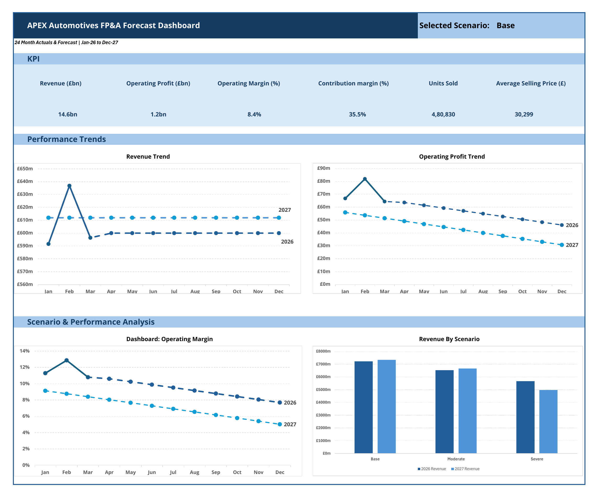
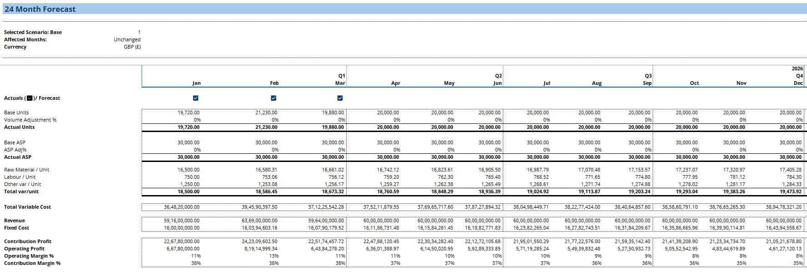
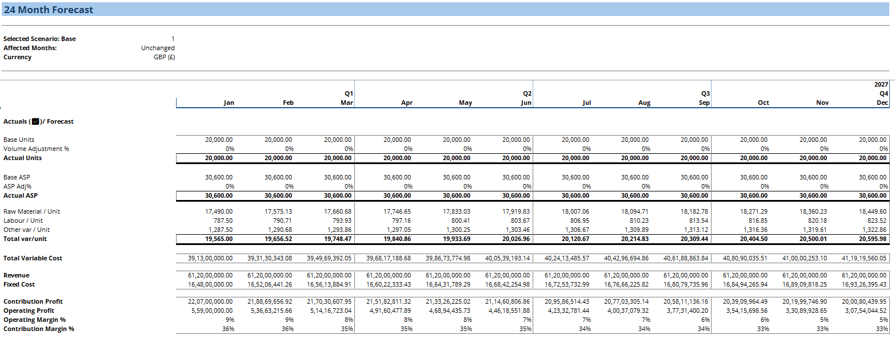
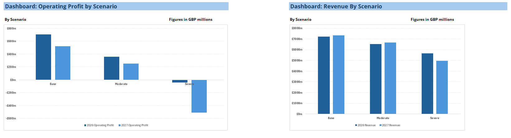
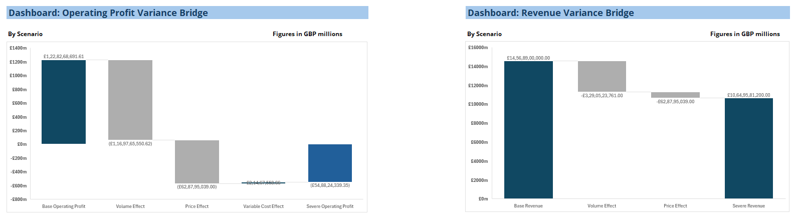

# APEX Automotives – FP&A Forecasting & Scenario Analysis

A driver-based FP&A forecasting and scenario-analysis model covering a 24-month planning horizon, incorporating Q1 2026 actual performance and a 21-month forward forecast.

## Dashboard Preview

---

## Company Background

APEX Automotives is a fictional UK-based electric vehicle manufacturer operating at an established mid-market scale. The company manufactures approximately 240,000 vehicles annually, with an average selling price of around £30,000 per vehicle.

As an automotive manufacturer, APEX operates in a cost-intensive environment where profitability is highly sensitive to production volumes, raw-material prices, labour costs, pricing decisions and fixed manufacturing expenditure.

The company is entering a period of increased uncertainty driven by input-cost inflation and potential demand pressure. Management therefore requires a forward-looking financial model capable of evaluating expected performance under different operating environments and assessing the impact of adverse market conditions on revenue, contribution profitability and operating margins.

---

## Problem Statement

APEX Automotives entered 2026 with a stable first quarter, with operational performance broadly in line with management expectations. However, management has become increasingly concerned about the possibility of a macroeconomic slowdown over the coming quarters and the potential effect this could have on the UK electric vehicle market.

For an automotive manufacturer, an economic downturn can translate into weaker discretionary consumer spending, tighter consumer credit conditions, higher vehicle-financing costs, increased price sensitivity and a contraction in new-vehicle demand. For an EV manufacturer specifically, these pressures can lead to lower sales volumes, greater pricing pressure, slower inventory turnover and reduced capacity utilisation.

Because APEX operates with a significant fixed-cost base, a reduction in vehicle volumes can also create operating deleverage, where revenue and contribution profit decline faster than fixed operating costs can adjust. This can result in substantial pressure on operating profit and margins during a prolonged downturn.

Following a stable Q1 2026, the CEO has therefore requested an FP&A scenario and sensitivity analysis to assess how the business could perform under different levels of economic stress and to determine the company's financial resilience during a period of uncertainty.

The model evaluates Base, Moderate and Severe scenarios across a 24-month planning horizon consisting of **3 months of actual performance and 21 months of forecast performance**.

---

## Project Objective

The objective of this project is to develop a driver-based FP&A forecasting and scenario-analysis model that:

- Incorporates Q1 2026 actual performance and forecasts the following 21 months;
- Models revenue using vehicle sales volume and Average Selling Price (ASP) as the primary commercial drivers;
- Incorporates raw-material, labour, other variable-cost and fixed-cost inflation;
- Evaluates Base, Moderate and Severe economic scenarios;
- Models volume and pricing shocks together with gradual post-shock recovery;
- Assesses the impact of demand contraction and operating leverage on contribution profit, operating profit and operating margins;
- Decomposes changes in Revenue and Operating Profit through variance analysis;
- Evaluates key financial and operational KPIs; and
- Presents management insights through an interactive FP&A dashboard.

---

## Model Structure

The Excel model is structured around a driver-based forecasting approach, where operational assumptions flow through to financial performance.

The workbook includes:

- **Assumptions** – operating assumptions, inflation drivers and scenario parameters;
- **Forecast Model** – 24-month monthly financial forecast incorporating Actual and Forecast periods;
- **Scenario Analysis** – Base, Moderate and Severe stress scenarios;
- **Contribution Analysis** – contribution profitability and unit economics;
- **KPI Analysis** – key financial and operational performance indicators;
- **Variance Analysis** – decomposition of Revenue and Operating Profit movements;
- **Graphs** – detailed trend and scenario visualisations; and
- **Dashboard** – executive-level summary of financial and operating performance.

---

## Forecast Model Preview

### 2026 Forecast View

### 2027 Forecast View

---

## Key Model Drivers

The model is primarily driven by:

- Vehicle sales volume;
- Average Selling Price (ASP);
- Raw-material cost per unit;
- Direct labour cost per unit;
- Other variable cost per unit;
- Monthly fixed operating costs;
- Raw-material inflation;
- Labour inflation;
- Other variable-cost inflation;
- ASP growth; and
- Fixed-cost inflation.

---

## Scenario Framework

Three operating scenarios are incorporated into the model.

### Base Scenario

Represents normal operating conditions based on management's underlying assumptions for vehicle volumes, pricing and cost inflation.

### Moderate Scenario

Represents a temporary economic slowdown involving weaker vehicle demand and pricing pressure, followed by a gradual recovery in sales volumes and ASP.

### Severe Scenario

Represents a prolonged economic downturn involving a more significant contraction in vehicle demand and greater pricing pressure. Due to APEX's high fixed-cost base, the scenario demonstrates the effect of operating deleverage and sustained pressure on operating profitability.

> **Note:** Scenario shock periods are fixed within the forecast model, while the corresponding dates displayed in the assumptions section are provided for reference.

### Scenario Analysis

---

## Key Financial Outputs

Under the Base scenario, the model produces approximately:

- **24-Month Revenue:** £14.6bn
- **24-Month Operating Profit:** £1.23bn
- **24-Month Operating Margin:** 8.4%
- **24-Month Contribution Margin:** 35.5%

The scenario analysis demonstrates how changes in vehicle volumes and pricing can materially affect profitability due to APEX's fixed-cost structure.

Approximate 24-month results across the three scenarios are:

| Scenario | Revenue | Operating Profit | Operating Margin |
| --- | ---: | ---: | ---: |
| Base | £14.57bn | £1.23bn | 8.43% |
| Moderate | £13.20bn | £0.61bn | 4.63% |
| Severe | £10.65bn | (£0.55bn) | (5.15%) |

---

## Variance Analysis

The model includes Revenue and Operating Profit variance bridges to identify the primary drivers of downside performance.

### Revenue Variance

Revenue variance is decomposed into:

- Volume Effect; and
- Price Effect.

### Operating Profit Variance

Operating Profit variance is decomposed into:

- Volume Effect;
- Price Effect;
- Variable Cost Effect; and
- Fixed Cost Effect.

The analysis highlights the significant impact that declining sales volumes can have on operating profitability when a large portion of the company's cost base remains fixed.

---

## Dashboard & Visualisation

The management dashboard provides a consolidated view of the selected operating scenario.

Headline KPIs include:

- Revenue;
- Operating Profit;
- Operating Margin;
- Contribution Margin;
- Units Sold; and
- Average Selling Price.

The workbook also includes visualisations covering:

- Revenue Trend;
- Operating Profit Trend;
- Operating Margin Trend;
- Units Sold;
- ASP Trend;
- Revenue by Scenario;
- Operating Profit by Scenario;
- Revenue Variance Bridge; and
- Operating Profit Variance Bridge.

---

## Skills Demonstrated

This project demonstrates practical application of:

- FP&A forecasting;
- Driver-based financial modelling;
- Scenario and sensitivity analysis;
- Revenue modelling;
- Cost and inflation modelling;
- Contribution analysis;
- Operating leverage analysis;
- KPI development;
- Variance analysis;
- Management reporting;
- Financial data visualisation; and
- Excel dashboard development.

---

## Tools Used

- Microsoft Excel
- GitHub

---

## Project File

The complete Excel model is available in this repository:

[Download the APEX Automotives FP&A Model](APEX_Automotives_FPA_Model.xlsx)

---

## Disclaimer

APEX Automotives is a fictional company and all financial and operational data used in this project is illustrative.

The project was developed solely for portfolio purposes and does not contain proprietary or confidential information from any real organisation.
